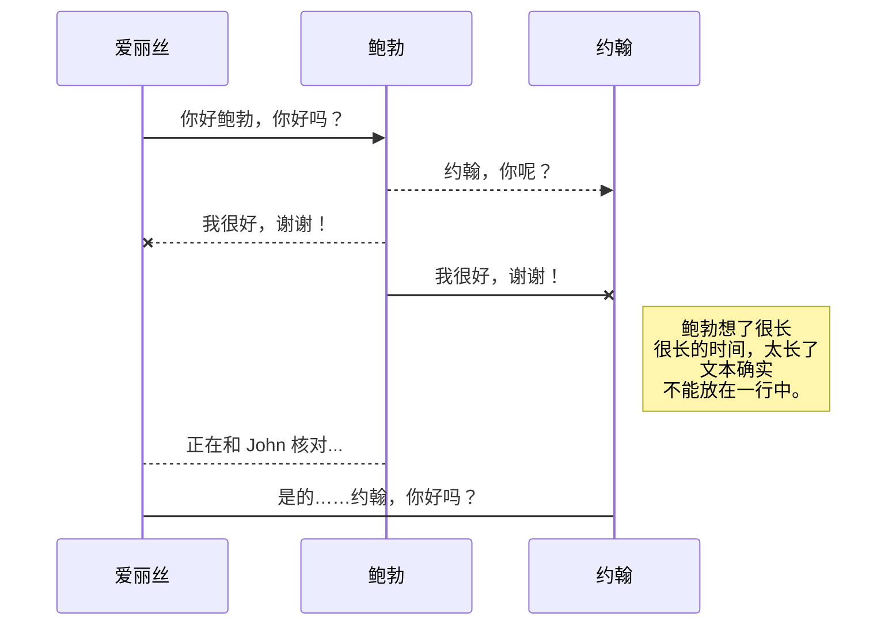
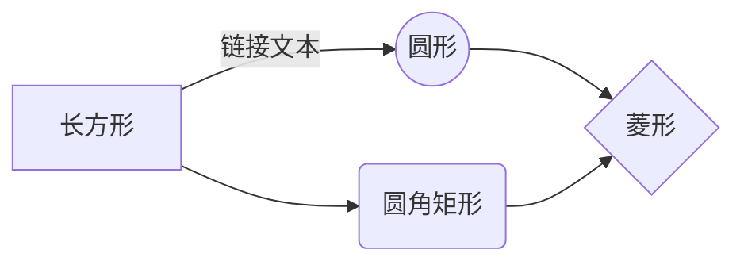

# Markdown扩展

StackEdit中文版 通过添加额外的 **Markdown扩展** 扩展了标准 Markdown 语法，为您提供了一些不错的功能。

> **提示：** 您可以在 **文件属性** 对话框中禁用任何 **Markdown 扩展名**。

## SmartyPants

SmartyPants 将 ASCII 标点字符转换为“智能”印刷标点 HTML 实体。例如：

| |ASCII |HTML |
|----------------|--------------------------------| ------------------------------|
|单反引号|`'这不好玩吗？'` |'这不好玩吗？' |
|引用|`“这不好玩吗？”` |“这不好玩吗？” |
|破折号 |`-- 是破折号，--- 是破折号`|-- 是破折号，--- 是破折号|

## KaTeX

您可以使用 [KaTeX](https://khan.github.io/KaTeX/) 渲染 LaTeX 数学表达式：

满足 $\Gamma(n) = (n-1)!\quad\forall n\in\mathbb N$ 的 *Gamma 函数* 是通过欧拉积分

$$
\Gamma(z) = \int_0^\infty t^{z-1}e^{-t}dt\,.
$$

> 您可以在 [这里](http://meta.math.stackexchange.com/questions/5020/mathjax-basic-tutorial-and-quick-reference) 找到有关 **LaTeX** 数学表达式的更多信息。

## UML 图

您可以使用 [Mermaid](https://mermaidjs.github.io/) 渲染 UML 图。例如，这将产生一个序列图：

这将产生一个流程图：

<!--stackedit_data:
eyJoaXN0b3J5IjpbODI5OTY5MTQ4XX0=
-->